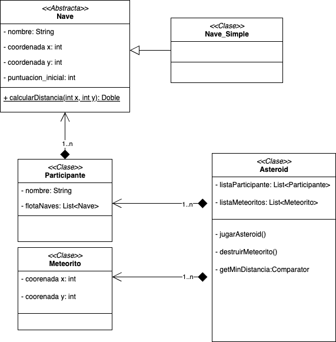

Ejercicio 2: Opcionales de Clases Abstractas e interfaces

Clase Abstracta nave
Nave simple extiende de Nave con la idea de que mantenga los atributos comunes de Nave para mantener la escabilidad a futuro del proyecto ay que participante siempre va tener una lista de Naves no importa cuales sean.
Se define la clase participante, meteorito.

La clase Asteroid estará definida con lista de participantes y meteoritos, más otra lógica para definir el ganador.
