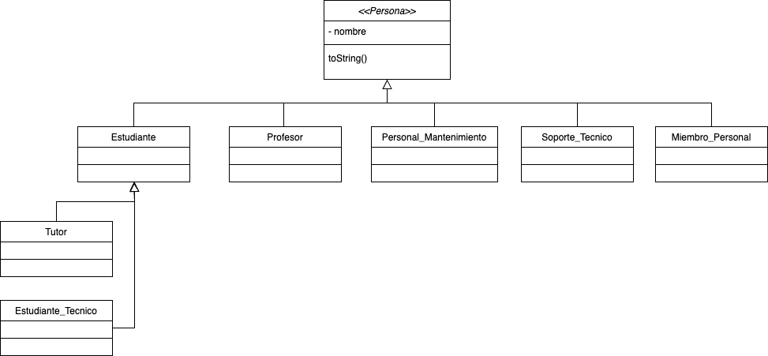

Material Complementario Clases Abstractas e Interfaces

Ejercicio 1:
Se plantea el modelado de Persona para una universidad.
Las personas involucradas son:
- Miembros del personal
- Estudiantes
- Profesores
- Personal Mantenimiento
- Tutores
- Personal de soporte técnico
- Estudiantes técnicos
Tutores y soporte técnico son Estudiantes que cumplen con esta función.
